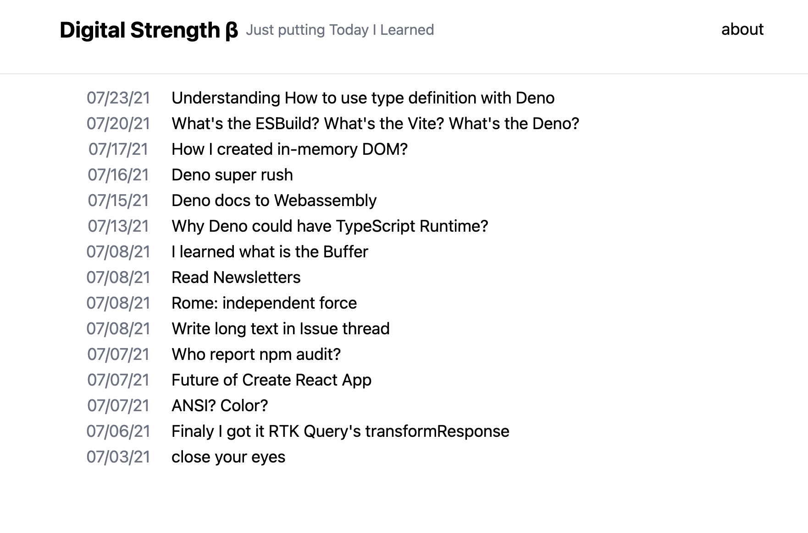

[](https://github.com/laststance/digital-strength/actions/workflows/ci.yml)
[](https://depfu.com/github/laststance/digital-strength?project_id=17741)
[](https://digitalstrength.dev/ )


# Digital Strength (Work in Progress 🚧 Not yet public release)

Prod ➡️ https://digitalstrength.dev  
Completely personal use for myself that small blog system for written what does I today learned.

[](https://digitalstrength.dev)


# Getting start local development

1. `yarn install`
2. `docker-compose up -d`
3. `yarn db:connection:test`
4. `yarn db:sync`
5. `yarn db:seed`
6. `yarn start`
7. `yarn server:start`

# NPM Scripts

## `yarn start`

Start local front-end dev server by create-react-app.

## `yarn build`

Make production front-end bundle.

## `yarn deploy`

run deploy.sh

```bash
# only server code
yarn deploy -s

# only client code
yarn deploy -c
```

## `yarn workflow:deploy`

all in one command for deploy

## `yarn test`

Run create-react-app tests.

## `yarn typecheck`

TypeScript type check in front-end.

## `yarn lint`

Run ESLint on create-react-app.

## `yarn lint:fix`

Run ESlint with --fix option on create-react-app.

## `yarn server:build`

Build `backend/` dir Express server.

## `yarn server:start`

## `yarn db:hashgen`

generate password hash.

## CRA environment variables
These are storing `.env` and evaluate at build time.

### REACT_APP_API_ENDPOINT
- dev: http://localhost:4000/api
- prod: https://digitalstrength.dev/api


### REACT_APP_ENABLE_SIGNUP
### REACT_APP_ENABLE_LOGIN

Default false.  
These only need initial setup at the production server. 

# Prod

### `docker-compose exec db mysql -u root -p`

login mysql with terminal.

## pm2

- `pm2 start eco.system.config.js`
- `pm2 stop all`
- `pm2 ps`

check node server status.
